Đăng nhập:

	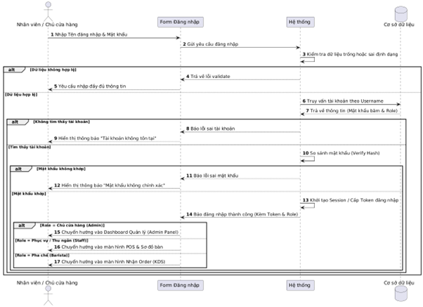

Gộp tách:

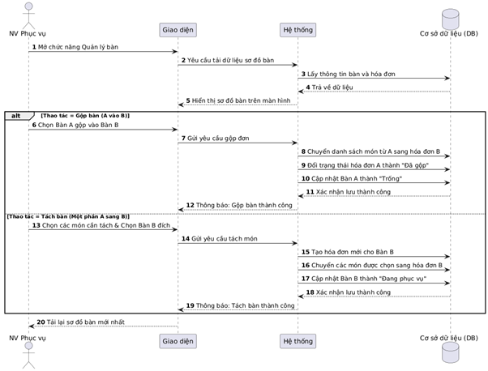

Order:

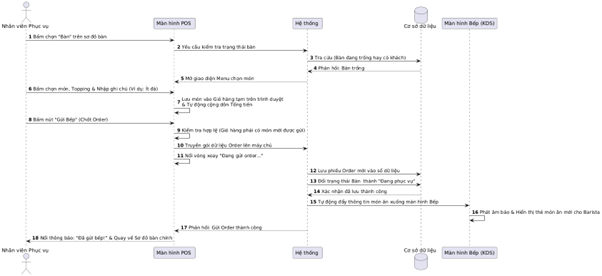

Thanh toán:

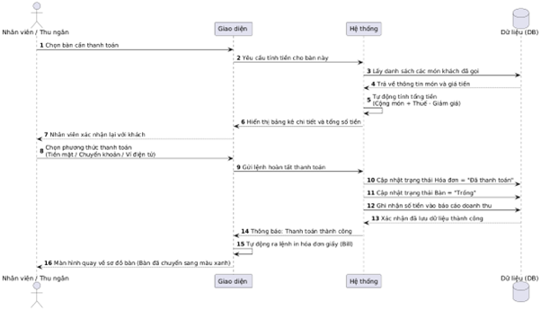

Quản lý sơ đồ bàn:

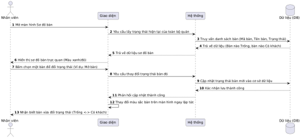

Thông báo hết món:

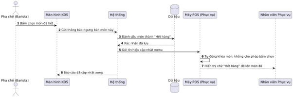

Tiếp nhận và trạng thái :

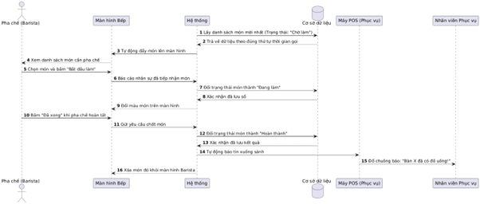

Quản lý menu:

    +Thêm món mới:

[1776943908325](image/tuantu/1776943908325.png)

+Sửa:

	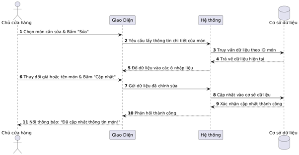

    +Ngừng kinh doanh món(xóa):

[1776943928137](image/tuantu/1776943928137.png)

Quản lý kho:

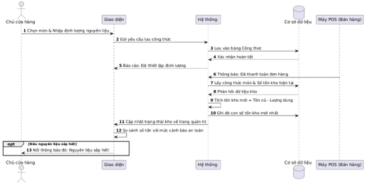

Báo cáo thống kê:

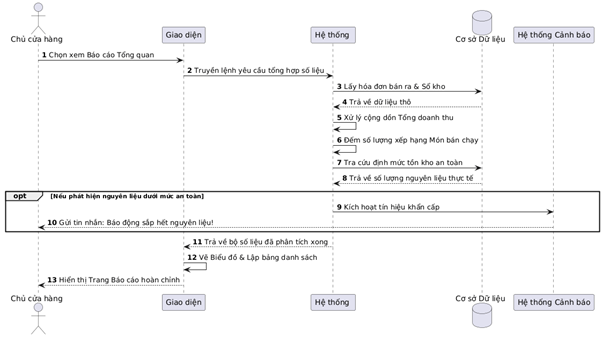

Quản lý nhân sự:

    +Thêm tknv:

[1776943957020](image/tuantu/1776943957020.png)

    +Sửa tknv:

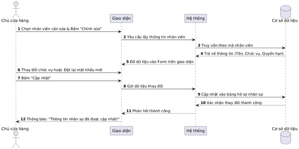

    +Xóa tknv:

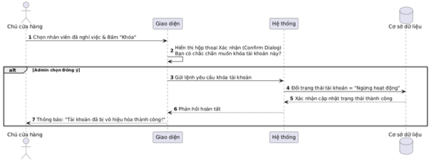

Quản lý lịch làm việc:

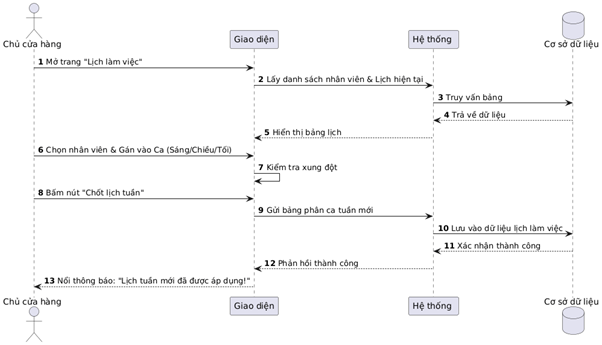

Cấu hình hệ thống:

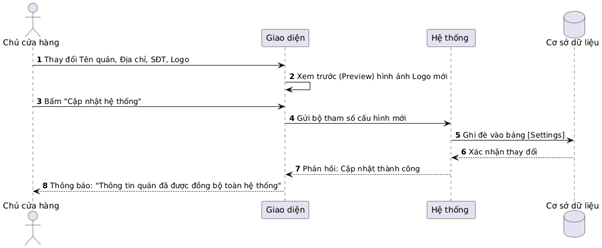

Phân quyền:

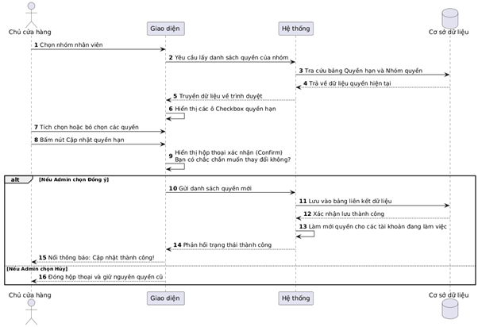
